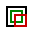

# GeoInterseQ

<p align="center">
  
  
</p>

**Versão 1.2.0** | **Autores:** Plat. Geo e Inovação

---

## Descrição

Plugin para o QGIS desenvolvido para calcular a área de interseção e o percentual de sobreposição entre uma camada base (de polígonos vetoriais) e múltiplas camadas analisadas (que podem ser tanto vetoriais quanto raster).

### Principais Funcionalidades
* **Análise vetor × vetor:** cruzamento espacial por feição, com campo de rótulo configurável.
* **Análise vetor × raster:** cruzamento espacial por classe (raster categórico inteiro), garantindo paridade numérica com a metodologia adotada pelo InfoGEO.
* **Flexibilidade de Escopo:** dois modos de cálculo percentual disponíveis:
  * `% da feição analisada` (ex: quanto da gleba intersecta o imóvel).
  * `% da camada base` (ex: quanto do imóvel é coberto pela feição analisada).
* **Camadas de Interseção:** geração de camadas temporárias de interseção com a simbologia original do raster aplicada automaticamente.
* **Exportação de Resultados:** exportação direta dos dados calculados em formato CSV (separador `;`, codificação UTF-8 com BOM para total compatibilidade com Excel).

---

## Requisitos

1. **QGIS >= 3.16** (inclui nativamente GDAL/OGR, numpy e PyQt5).
2. **Para análise de camadas RASTER:**
   * `rasterio`
   * `shapely`
   * `pyproj`

> [!NOTE]
> Caso alguma das dependências acima esteja ausente, o plugin exibirá um alerta ao iniciar o QGIS. A análise de dados puramente vetoriais continuará operacional.

---

## Instalação de Dependências

### Opção A — OSGeo4W Shell (Recomendado)
1. Abra o **OSGeo4W Shell** como Administrador.
2. Execute o comando:
   ```bash
   pip install rasterio shapely pyproj
   ```

### Opção B — Console Python do QGIS
1. No menu principal do QGIS, acesse **Plugins > Console Python**.
2. Execute o seguinte trecho de código:
   ```python
   import subprocess, sys
   subprocess.check_call([sys.executable, '-m', 'pip', 'install', 'rasterio', 'shapely', 'pyproj'])
   ```

Após a instalação das bibliotecas por qualquer uma das opções, reinicie o QGIS.

---

## Instalação do Plugin

1. No QGIS, acesse: **Plugins > Gerenciar e Instalar Plugins > Instalar a partir de arquivo ZIP**.
2. Selecione o arquivo `geointerseq_v1.2.0.zip` gerado.

---

## Suporte e Manutenção

* **Equipe de Desenvolvimento:** Plat. Geo e Inovação
