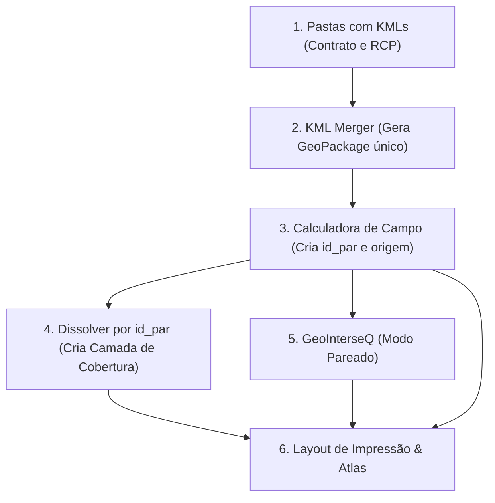

# 🗺️ Guia Passo a Passo: Fluxo Completo no QGIS (Contrato × RCP com Atlas)

Este tutorial consolida todo o processo prático no QGIS, desde a união dos arquivos KML até a geração dos mapas automatizados via Atlas com o cálculo corrigido de sobreposição.

---

## 📌 Visão Geral do Fluxo



---

## 🔹 Etapa 1: Instalar os Plugins Atualizados no QGIS

1. No menu superior do QGIS, vá em **Complementos** > **Gerenciar e Instalar Complementos...**
2. Clique na aba lateral **Instalar a partir do ZIP**.
3. Clique em **...** (Buscar) e instale sequencialmente:
   - `kml_merger.zip`
   - `GeoInterseQ.zip`
4. Certifique-se de que ambos aparecem marcados com ✅ na aba **Instalados**.

---

## 🔹 Etapa 2: Mesclar os KMLs com o KML Merger

1. No menu **Ferramentas Geo**, clique em **KML Merger – Mesclar KMLs**.
2. Preencha as configurações:
   - **Origem dos Arquivos KML:** Selecione a pasta raiz que contém as subpastas de RefBacen (ou arquivo ZIP).
   - **Pasta de Destino:** Escolha onde salvar o GeoPackage de trabalho.
   - **Nome do Arquivo:** `proagro`
   - **Formato de Saída:** Marque **GeoPackage (.gpkg)**.
3. Clique em **Executar**.
4. A camada `proagro` será gerada com geometria **MultiPolygon** (suportando arquivos com mais de uma gleba) e carregada automaticamente no painel de camadas.

---

## 🔹 Etapa 3: Criar os Campos de Controle (`RefBacen`, `id_par` e `origem`)

Abra a **Tabela de Atributos** da camada `proagro`, clique no botão **Abrir calculadora de campo** (ícone do ábaco `Ctrl + I`) e crie os três campos abaixo:

### 3.1. Campo `RefBacen` (Número do processo base sem o sequencial)
*Extrai apenas a numeração do processo da RefBacen (ex: `20230063980-1 contrato.kml` → `20230063980`).*

- Marque **Criar um novo campo**.
- **Nome do campo de saída:** `RefBacen`
- **Tipo do campo:** `Texto (string)`
- **Comprimento:** `50`
- **Expressão:**
  ```sql
  left("Arquivo", strpos("Arquivo", '-') - 1)
  ```
  *(Alternativa com regex: `regexp_substr("Arquivo", '^[0-9]+')`)*

---

### 3.2. Campo `id_par` (Chave única de pareamento com sequencial)
*Agrupa o Contrato e o RCP pertencentes ao mesmo processo e sequencial (ex: `20230573214-1`).*

- Clique novamente no ábaco da Calculadora de Campo.
- Marque **Criar um novo campo**.
- **Nome do campo de saída:** `id_par`
- **Tipo do campo:** `Texto (string)`
- **Comprimento:** `50`
- **Expressão:**
  ```sql
  left("Arquivo", strpos("Arquivo", ' ') - 1)
  ```
  *(Se algum arquivo não possuir espaço antes da extensão, use a alternativa: `regexp_substr("Arquivo", '^[^ ]+')`)*

---

### 3.3. Campo `origem` (Identificador do lado do par)
*Distingue se a geometria representa a gleba do Contrato ou do RCP.*

- Clique novamente no ábaco da Calculadora de Campo.
- Marque **Criar um novo campo**.
- **Nome do campo de saída:** `origem`
- **Tipo do campo:** `Texto (string)`
- **Comprimento:** `20`
- **Expressão:**
  ```sql
  regexp_substr(lower("Arquivo"), 'rcp|contrato')
  ```
- Salve as edições da camada clicando no ícone do lápis (Alternar modo de edição).

---

## 🔹 Etapa 4: Criar a Camada de Cobertura do Atlas

A camada de cobertura define a extensão e a navegação de cada página do Atlas.

1. No menu superior, vá em **Vetor** > **Geoprocessamento** > **Dissolver...**
2. Configure:
   - **Camada de entrada:** `proagro`
   - **Campos dissolvidos:** Clique em `...` e marque apenas `id_par`.
   - **Dissolvido:** Salve como camada no mesmo GeoPackage com o nome `cobertura_id_par`.
3. Clique em **Executar**.
4. **Dica:** Nas propriedades da camada `cobertura_id_par`, defina a simbologia como **Sem símbolo** (ela serve apenas para guiar o Atlas, sem poluir visualmente o mapa).

---

## 🔹 Etapa 5: Calcular as Interseções no GeoInterseQ (Modo Pareado)

1. No menu **Ferramentas Geo**, abra o **GeoInterseQ**.
2. **Camada base:** Selecione `proagro`.
3. Marque a caixa de seleção: **☑ Modo pareado — interseção restrita por campo-chave e origem**.
4. Clique em **Adicionar camada analisada** e selecione a mesma camada `proagro`.
   - **Campo de rótulo:** Escolha `id_par` *(ele será usado como a chave de pareamento)*.
   - **Base do percentual:** Escolha `% da feição analisada` (ou conforme sua regra de negócio).
   - **Campo de origem:** Selecione o campo `origem`.
5. Clique em **Calcular**.
6. Uma nova camada de memória chamada `Interseções (GeoInterseQ)` será criada contendo a geometria e a área de sobreposição calculada **exclusivamente dentro de cada par**.
   > **Nota:** Para pares sem sobreposição (como `20230165343-1`), o resultado será registrado com `0,0000 ha / 0,00%`.
7. Clique com o botão direito na camada temporária `Interseções (GeoInterseQ)` e exporte-a para o seu GeoPackage como `sobreposicao_pares`.

---

## 🔹 Etapa 6: Configurar a Simbologia Baseada em Regras

Para que cada página do mapa mostre **somente** as glebas e sobreposições referentes ao `id_par` da página ativa:

### 6.1. Simbologia da Camada `proagro`
Abra as **Propriedades** da camada `proagro` > aba **Simbologia** > altere o tipo para **Baseado em regras**. Adicione 2 regras:

| Regra | Rótulo | Filtro (Expressão) | Estilo Recomendado |
|---|---|---|---|
| **1** | `Contrato` | `lower(trim("origem")) = 'contrato' AND trim("id_par") = trim(attribute(@atlas_feature, 'id_par'))` | Preenchimento vermelho semitransparente, contorno vermelho escuro |
| **2** | `RCP` | `lower(trim("origem")) = 'rcp' AND trim("id_par") = trim(attribute(@atlas_feature, 'id_par'))` | Preenchimento transparente, contorno azul tracejado |

---

### 6.2. Simbologia da Camada de Sobreposição (`sobreposicao_pares`)
Abra as **Propriedades** da camada > **Simbologia** > **Baseado em regras**:

| Regra | Rótulo | Filtro (Expressão) | Estilo Recomendado |
|---|---|---|---|
| **1** | `Sobreposição Contrato × RCP` | `trim("class") = trim(attribute(@atlas_feature, 'id_par'))` | Hachura diagonal verde, contorno verde sólido |

---

## 🔹 Etapa 7: Configurar o Layout de Impressão e o Atlas

1. Vá em **Projeto** > **Novo Layout de Impressão...** (Nome: `Mapa_Proagro_Atlas`).

### 7.1. Ativar e Configurar o Atlas
1. No painel direito, acesse a aba **Atlas** > clique em **Configuração do Atlas**.
2. Marque **Gerar Atlas**.
3. **Camada de cobertura:** `cobertura_id_par`
4. **Nome da página:** `id_par`
5. **Filtrar com:** Deixe vazio (ou filtre se desejar exportar apenas um lote).
6. **Ordenar por:** `id_par` (Crescente).

---

### 7.2. Configurar o Item de Mapa
1. Adicione um **Mapa** na folha.
2. Na aba **Propriedades do item** do Mapa:
   - Marque **☑ Controlado pelo Atlas**.
   - **Margem em torno da feição:** `20%` a `30%` (garante que as glebas caibam com folga na moldura).

---

### 7.3. Título Dinâmico
Adicione um item de **Rótulo** (Texto) para o título principal:
```sql
[% 'Ref Bacen: ' || attribute(@atlas_feature, 'id_par') %]
```

---

### 7.4. Tabela 1: Áreas das Glebas (Contrato e RCP)
Adicione um item de **Tabela de Atributos** no Layout:
- **Fonte:** `Feições da camada`
- **Camada:** `proagro`
- **Mostrar somente feições visíveis no mapa:** ❌ *Desmarcado*
- **Filtrar com:** ☑ *Marcado*
  ```sql
  trim("id_par") = trim(attribute(@atlas_feature, 'id_par'))
  ```
- **Atributos (Colunas):**
  - **Coluna 1 (Tipo):**
    - *Cabeçalho:* `Tipo`
    - *Expressão:*
      ```sql
      CASE 
          WHEN lower(trim("origem")) = 'contrato' THEN 'Contrato'
          WHEN lower(trim("origem")) = 'rcp' THEN 'RCP'
          ELSE "origem"
      END
      ```
  - **Coluna 2 (Área):**
    - *Cabeçalho:* `Área da Gleba`
    - *Expressão:*
      ```sql
      format_number("Area_ha", 4) || ' ha'
      ```

---

### 7.5. Tabela 2: Área e % de Sobreposição
Adicione uma segunda **Tabela de Atributos** no Layout:
- **Fonte:** `Feições da camada`
- **Camada:** `sobreposicao_pares` (ou camada do GeoInterseQ)
- **Mostrar somente feições visíveis no mapa:** ❌ *Desmarcado*
- **Filtrar com:** ☑ *Marcado*
  ```sql
  trim("class") = trim(attribute(@atlas_feature, 'id_par'))
  ```
- **Atributos (Colunas):**
  - **Coluna 1 (Área de Sobreposição):**
    - *Cabeçalho:* `Área Sobreposição`
    - *Expressão:*
      ```sql
      format_number("area_ha", 4) || ' ha'
      ```
  - **Coluna 2 (Percentual):**
    - *Cabeçalho:* `Sobreposição (%)`
    - *Expressão:*
      ```sql
      format_number("percent", 2) || ' %'
      ```

---

## 🔹 Etapa 8: Validação dos Casos de Teste

Antes de exportar todos os PDFs/Imagens:

1. Na barra de ferramentas do **Atlas**, clique em **Visualizar Atlas** (ícone de mapa com olho).
2. **Navegue até o caso `20230165343-1`:**
   - Verifique se a página desenha a gleba do Contrato e a do RCP afastadas.
   - A tabela de sobreposição deve informar: `0,0000 ha` e `0,00 %`.
3. **Navegue até o caso excepcional `20191595422`:**
   - Verifique que existem **duas páginas independentes**: `20191595422-1` e `20191595422-2`.
4. Vá em **Atlas** > **Exportar Atlas como PDF...** ou **Exportar Atlas como Imagens...** para gerar o lote completo.
